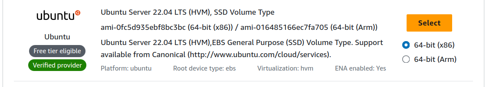

# Cloud Tasks with DagOnStar

DagOnStar supports the deployments on the following Cloud Providers:

* Google Cloud 
* Amazon EC2
* DigitalOcean

## Preconfigurations

Depending on the Cloud Provider different access token and keys could be required. Please, consult the documentation of the provider to get the access tokens. For example, to work with EC2 is required temporal key and a secret token. These keys have to be added to the ```dagon.ini```, as follows:

```conf
[ec2]
key=<my_key>
secret=<my_secret>
region=<ec2_region>
```

The file ```dataflow-demo-cloud.py``` runs a workflow composed of two tasks deployed on two virtual machines on EC2. The characteristics of the EC2 instances are configured using a dictionary, as follows:

```python
ec2_flavour = {"image": "ami-0fc5d935ebf8bc3bc", "size": "t1.micro"}
```

The ```ìmage``` value is ID of a valid Amazon Machine Image. To find the ID of an AMI, just go to the AWS console, and browse the AMI Catalog. Under the name of the AMI is available the ID of the image.



The ```size``` value refers to the instance type of your virtual machine. You can find a complete list of instance types on [https://aws.amazon.com/ec2/instance-types/](https://aws.amazon.com/ec2/instance-types/).  

Next, we have to specify the SSH parameters to enable the communication between DagOnStar engine and the virtual machines. You can create a new SSH key or choose an existing one, previously loaded on the platform of your cloud provider. 

    * To create a new key, declare a dictionary as follows:

    ```python
    ssh_key_ec2 = {"option": cm.KeyOptions.CREATE, "key_path": "/path/to/store/key.pem", "cloud_args": {"name": "test-key2"}}
    ```

    Note, that depending on the cloud provider the parameters changes. On Google Cloud and EC2 is required to first create the public and private keys, and then added to the parameters of the dictionary. For example:

    ```python
    keyPair = KeyPair.generate_RSA()

    googleKeyParams = {"keypath": "/path/to/store/key.pem", "username": "dagon", "public_key": keyPair[1],
                       "private_key": keyPair[0]}
    digitalOceanKeyParams = {"option": KeyOptions.CREATE, "keypath": "/path/to/store/key.pem",
                     "cloudargs": {"name": "dagon", "public_key": keyPair[1], "private_key": keyPair[0]}}
    ```

    * To use an existing key already added to EC2, you must declare a dictionary as follows:

    ```python
    ssh_key_ec2_taskA = {"option": cm.KeyOptions.GET, "key_path": "/path/to/key.pem", "cloud_args": {"name": "dagon_services"}}
    ```

Then, you must declare the DagOnStar tasks using ```TaskType.CLOUD``` and passing the as arguments the ```instance flavour``` and ```key configuration``` dictionaries. Also, the provider and name of the instance must be indicated, as follows:

```python
taskA = DagonTask(TaskType.CLOUD, "A", "mkdir output;echo I am A > output/f1.txt", Provider.EC2, "ubuntu", ssh_key_ec2_taskA, instance_flavour=ec2_flavour, instance_name="dagonTaskA", stop_instance=True)
```

## Execution of the demo

This example is configured to run on Amazon EC2.

Open the root directory of DagOnStar in a terminal, and run the following commands to prepare it.

```bash 
virtualenv venv  
. venv/bin/activate  
pip install -r requirements.txt  
export PYTHONPATH=$PWD:$PYTHONPATH  
```

Now navigate to the directory of the demo.

```bash 
cd examples/dataflow/cloud
```

> [!NOTE]  
> If you don't have any SSH key configured, you can create a new unconmenting the line 19 and commenting the line 20 of the script.

Execute the file ```dataflow-demo-cloud.py``` as follows:

```bash 
python dataflow-demo-cloud.py
```

During the execution of the script, two instances will be created on EC2. Note that these instances will be created using the default security group. You must configure it to enable access through SSH, which is the protocol used by DagOnStar to execute remote tasks. 

> [!WARNING]  
> We are working on a bug preventing DagOnStar to stop instances. Please, remember to manually stop or terminate your instances after retrieve your data.

> [!WARNING]  
> Data are not automatically downloaded to DagOnStart main host. Pleases, remember to retrieve your data after when the execution of the workflow is completed.

When the execution of the workflow is completed, you must see an output on the terminal as follows:

```console
(venv) domizzi@domizzi:~/Documents/GitHub/dagonstar-globusdemo/examples/dataflow/cloud$ python dataflow-demo-cloud.py 
2023-10-25 20:53:02,737 root         DEBUG    Running workflow: DataFlow-Demo-Cloud
2023-10-25 20:53:02,737 root         DEBUG    A: Status.WAITING
2023-10-25 20:53:02,737 root         DEBUG    A: Status.RUNNING
2023-10-25 20:53:02,737 root         DEBUG    A: Executing...
2023-10-25 20:53:02,738 root         DEBUG    B: Status.WAITING
2023-10-25 20:53:48,660 root         DEBUG    A: Scratch directory: /tmp//1698260025898-A
2023-10-25 20:53:51,998 root         DEBUG    A Completed in 0.8933219909667969 seconds ---
2023-10-25 20:53:54,001 root         DEBUG    A: Status.FINISHED
2023-10-25 20:53:54,001 root         DEBUG    B: Status.RUNNING
2023-10-25 20:53:54,001 root         DEBUG    B: Executing...
2023-10-25 20:54:48,492 root         DEBUG    B: Scratch directory: /tmp//1698260087488-B
2023-10-25 20:54:54,144 root         DEBUG    B Completed in 2.123697519302368 seconds ---
2023-10-25 20:54:54,412 root         DEBUG    Removed instance 34.201.91.120
2023-10-25 20:54:56,413 root         DEBUG    B: Status.FINISHED
2023-10-25 20:54:56,414 root         INFO     Workflow 'DataFlow-Demo-Cloud' completed in 113.6767635345459 seconds ---
(venv) domizzi@domizzi:~/Documents/GitHub/dagonstar-globusdemo/examples/dataflow/cloud$ 
```