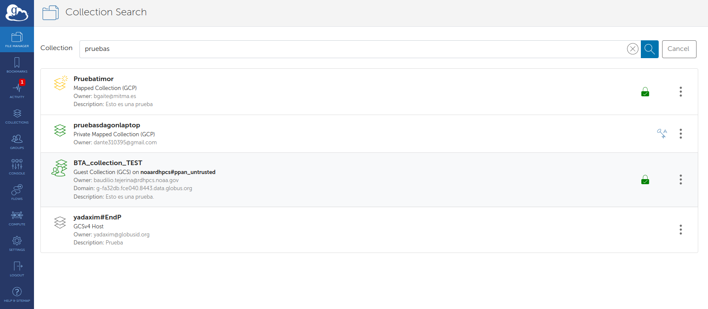
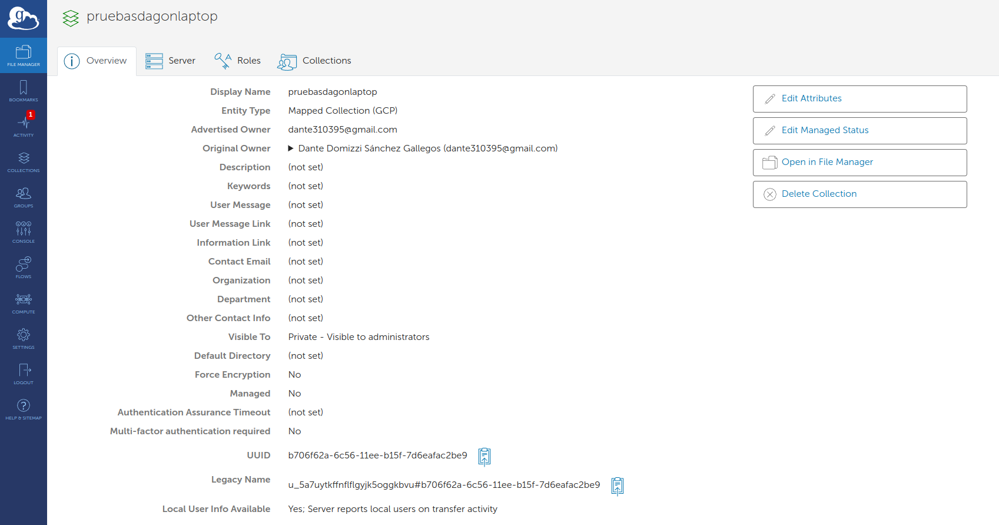
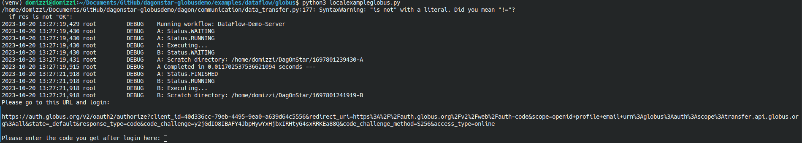
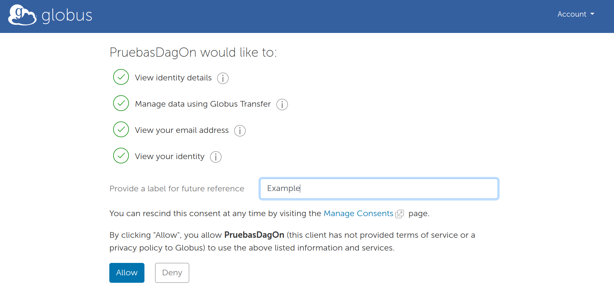
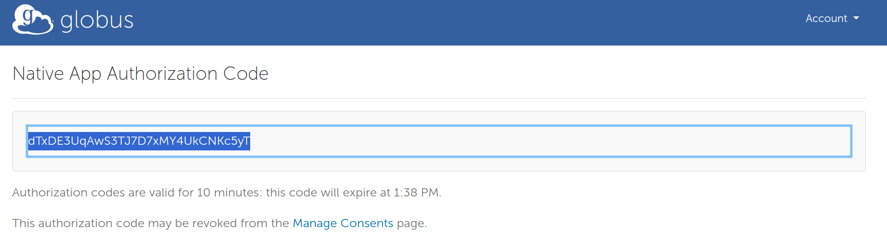
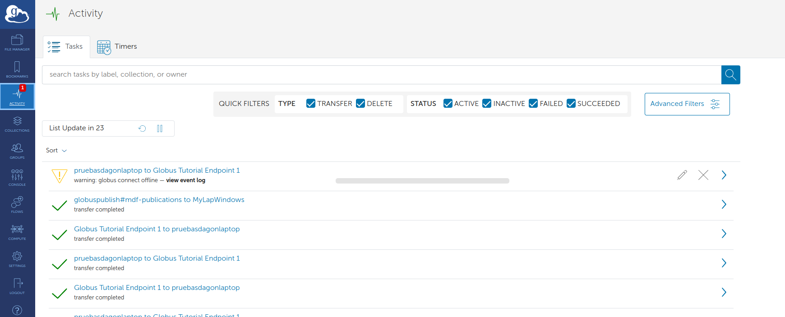
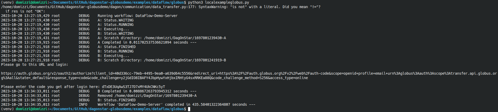

# DagOnStar and Globus Transfer

## Requirements 

Additional to DagOnStar requirements, the following requirements are required to run this example:

* [Globus Connect Personal](https://www.globus.org/globus-connect-personal)  or [Globus Connect Server](https://www.globus.org/globus-connect-server)

## Preconfigurations

To run this example, at least three endpoints UUID are required.

1. Source endpoint: The first one is the UUID of the endpoint where the data is produced.
2. Intermediate endpoint: The second one is the UUID of an endpoint accesible through Internet. This can be the UUID of a Globus Connect Server endpoint. For this demo, we are using the  [Globus Tutorial Endpoint 1]( Globus Tutorial Endpoint 1).
3. Sink endpoint: The third one is the UUID of the endpoint where the data is produced.

The first and third endpoints can be configured using Globus Connect Personal. 

To get the UUID of an enpoint, first go to [https://app.globus.org/](https://app.globus.org/) and log in. The navigate to File Manager. In ```Collection```, just writte the name of your endpoint/collection and click on the three dots on the right. 



A new page with an overview of the endpoint is open. From this page, you can copy the UUID.



Repeat these steps to get the UUID of the three endpoints.

Moroever, it is required to have a Globus Client ID. To get it, please follow the next steps:

1. Go to [https://developers.globus.org/](https://developers.globus.org/) and click on ```Manage and Register Applications```.
2. Log in or Sign In in the Goblus Authenticator.
3. Click on ```Register a service account or application credential for automation```.
4. Choose or create a new project.
5. Enter the name of the App, and click on ```Register App```.
6. Copy the Client UUID and save it. 


Open the file ```dagon.ini``` and in the globus section paste your client ID and the UUID of the intermediate endpoint, as follows: 

```conf
[globus]
clientid=40d336cc-79eb-4495-9ea0-a639d64c5556
intermadiate_endpoint = ddb59aef-6d04-11e5-ba46-22000b92c6ec
```

In this file, also replace the ```scratch_dir_base``` with any directory in your home partition. For example, ```/home/USER/DagOnStar```.

Now, open the file ```dataflow-demo-globus.py```, and replace the ```globusendpoint``` variable of ```taskA``` and ```taskB```.

## Execution of the demo

Open the root directory of DagOnStar in a terminal, and run the following commands to prepare it.

```bash 
virtualenv venv  
. venv/bin/activate  
pip install -r requirements.txt  
export PYTHONPATH=$PWD:$PYTHONPATH  
```

Now navigate to the directory of the demo.

```bash 
cd examples/dataflow/globus
```

Execute the file ```dataflow-demo-globus.py``` as follows:

```bash 
python dataflow-demo-globus.py
```

During the execution, you will requested to log in the Globus services. Click on the URL provided by the application, log in Globus, and paste the token on the console of th application. Remember, that if you are using Globus Personal Connect you must start it on your endpoint.








Now, the workflow is in execution and the results of the first stage are uploaded in Globus and download by the second stage. You can monitor the transference of data by log in the [Globus File Manager](https://app.globus.org/activity).



Wait until the execution of the workflow is completed. 



You can see the results of the execution on the scratch directory.