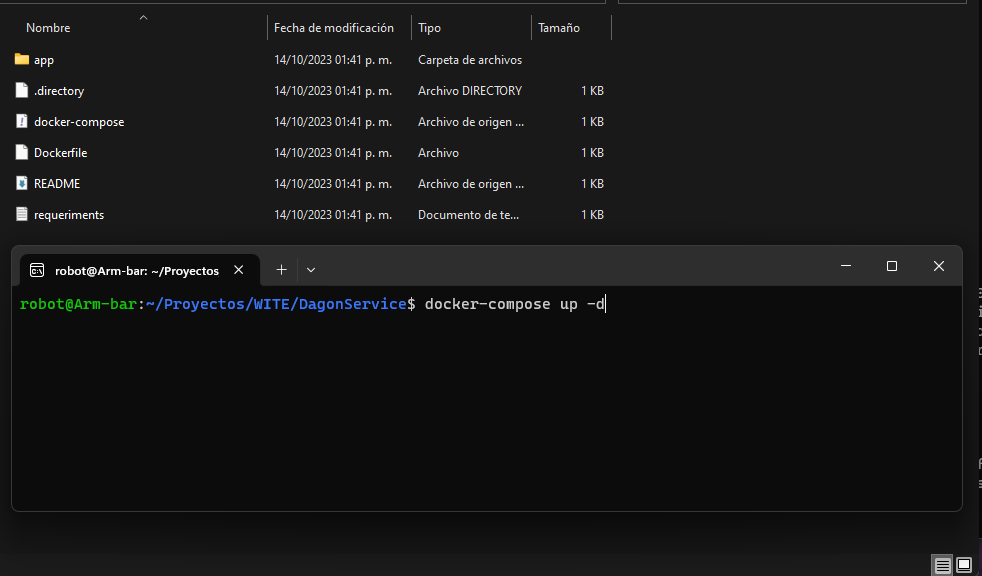
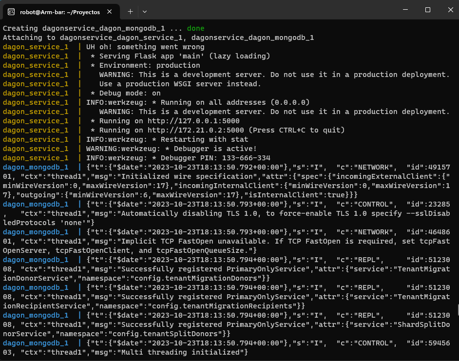
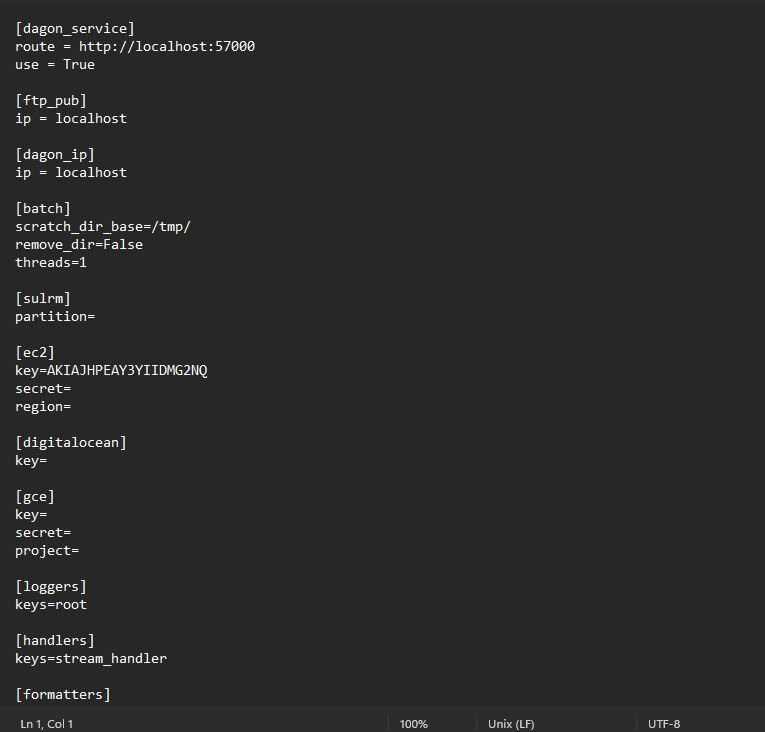
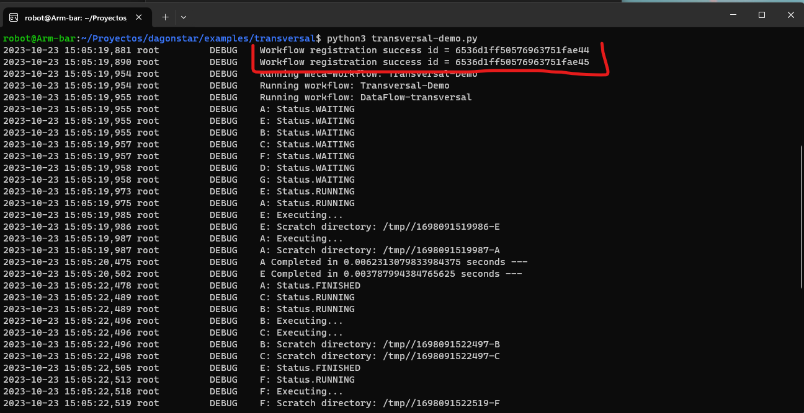
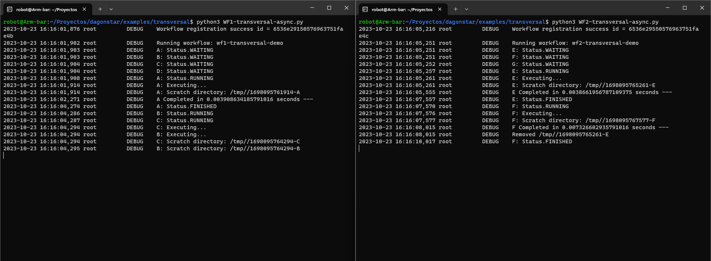
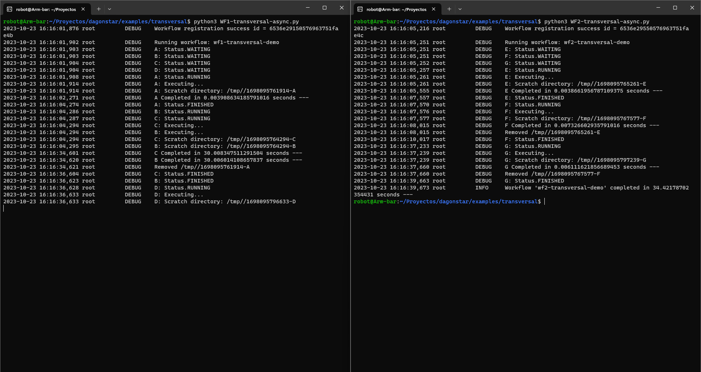

# DAGonStar Examples


## Transversality

Dagon has the characteristic of transversality, allowing you to create dependencies in workflows towards already existing workflows and even in execution, or to build workflows of workflows for joint execution.

## Requirements

Additional to DagOnStar requirements, the following requirements are required to run this examples:
    
- [DagOnService](https://github.com/DagOnStar/DagOnService) deployed.
- URL to DagOnService Specified in dagon.ini file.

## Preconfigurations
To run these examples, you need access to a [DagOnService](https://github.com/DagOnStar/DagOnService) instance. For this we must run the service using a Docker container and Docker-compose.

To do this, you must run the "_docker-compose up_" command in the root folder of the DagOnService, inside the server where docker and docker-compose are installed. 



As a result, the construction of container images will take place. Upon completion, the containers will turn on, obtaining information such as the following in the console:



Open the dagon.ini file and in the dagon_service section paste the IP (or DNS name) of the host computer where the dagon servi



In this file, also replace the ```scratch_dir_base``` with any directory in your home partition. For example, ```/home/USER/DagOnStar```.  This directory is where all the results will be placed.


### Demo 1 - Metaworkflows
---

Build of a metaworkflow composed of 2 different workflows: DataFlow-Demo-Server and DataFlow-traversal. DataFlow traversal depends on DataFlow-Demo-Server tasks A and C.

#### Steps

1.- Open the root directory of DagOnStar in a terminal, and run the following commands to prepare it.

```bash 
virtualenv venv  
. venv/bin/activate  
pip install -r requirements.txt  
export PYTHONPATH=$PWD:$PYTHONPATH  
```
2.- Now navigate to the directory of the demo.

```bash 
cd examples/transversal/
```
Execute the ```transversal-demo.py``` file as follows:

    python transversal-demo.py

If the DagonService is active, the registration workflow log lines will be displayed in the console. These workflows are registered in the Dagon service and can be consulted by other workflows.



Wait until the execution of the workflow is completed. You can see the results of the execution on the scratch directory.

### Demo 2 - Dependencies between workflows. Avoiding cycles.
---

Build of a metaworkflow composed of 3 different workflows with a cycle in their dependencies. 


#### Steps

1.- Open the root directory of DagOnStar in a terminal, and run the following commands to prepare it.

```bash 
virtualenv venv  
. venv/bin/activate  
pip install -r requirements.txt  
export PYTHONPATH=$PWD:$PYTHONPATH  
```
2.- Now navigate to the directory of the demo.

```bash 
cd examples/transversal/
```
3.- Execute the ```transversal-cycle.py``` file as follows:

    python transversal-cycle.py

When you run the file, an error will be displayed. This is because the formation of a cycle between the transversal dependencies of the workflwos is detected, which results in an infinite wait.


It is possible to fix this error by removing one of the dependencies in order to avoid the cycle.

### Demo 3 - Asynchronous dependency
---

 Example of an asynchronous traversal dependency. 
#### Steps

1.- Open the root directory of DagOnStar in a terminal, and run the following commands to prepare it.

```bash 
virtualenv venv  
. venv/bin/activate  
pip install -r requirements.txt  
export PYTHONPATH=$PWD:$PYTHONPATH 
```
2.- Now navigate to the directory of the demo.

```bash 
cd examples/transversal/
```
3.- Execute the ```WF1-transversal-async.py``` file as follows:

    python WF1-transversal-async.py

When you run the file, the execution of a basic DagOn workflow will begin. This will be registered in the DagOnService and will be able to be consulted by other workflows. To test this, we can run a a second workflow with a dependency to the first one.

4.- While the previous workflow is still running, execute the commands from step 1 and 2 in another terminal. Subsequently, execute the ```WF2-transversal-async.py``` file as follows:

    python WF2-transversal-async.py




```WF2-transversal-async.py```  contains a generic workflow in Dagon but with a dependency to _wf1-transversal-demo_ in ```WF1-traversal-async.py``` . 

Once tasks A and C of the _wf1-transversal-demo_ workflow are completed, the _wf2-transversal-demo_ workflow will continue its execution.


